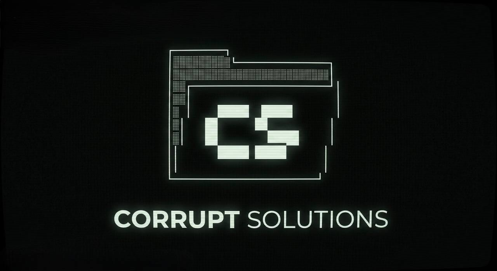

# 💠 CorruptCLI: The Autonomous SaaS Engine



**CorruptCLI** is a high-performance, "Business-in-a-Box" deployment suite designed for Corrupt Solutions. It provides a zero-cost, serverless architecture that can be stood up in minutes to manage booking, scheduling, and recurring revenue for any service-based business.

This repository is **Agent-Optimized**: It includes codified skills and CLI tools that allow AI agents (Vertex, Claude, etc.) to autonomously manage the entire deployment lifecycle—from rebranding to infrastructure provisioning.

---

## ⚡ Core Capabilities

### 1. 🏗️ Intelligent Scaffolding (`corrupt.py`)
The engine doesn't just copy files; it performs an intelligent rebranding.
- **Instant Theming**: Automatically injects client names, domains, admin emails, and primary brand colors across the entire frontend and backend.
- **Optional Features**: Choose which modules to include (e.g., liability waiver system).
- **Environment Generation**: Produces `.env.template` with all required secrets.

### 2. 🔐 Production-Grade Security
- **Row Level Security (RLS)** on all database tables
- **Edge Function Proxies** for sensitive data access (no direct client reads)
- **OTP Authentication** for admin access (no passwords)
- **Device Trust** with configurable 30-day session persistence

### 3. 💳 Full Payment Stack
- **Stripe Checkout** for one-time class payments
- **Credit Packs** with atomic deduction via database triggers
- **Membership Subscriptions** with expiry tracking
- **Webhook Processing** for payment event handling

### 4. 📧 Automated Communications
- Welcome emails, booking confirmations, schedule reminders
- Credit depletion alerts, waiver reminders
- Admin notifications for all customer actions
- CAN-SPAM compliant unsubscribe handling

### 5. 📡 Admin Command Center
- **OTP-secured admin portal** with class management
- **Customer management** with booking history and credit tracking
- **Class scheduling** with capacity and instructor management
- **Attendance tracking** with check-in and no-show management
- **Financial dashboard** with revenue tracking

---

## 🚀 Quick Start

```bash
# 1. Clone the repo
git clone https://github.com/CorruptFun/CorruptCLI-Engine.git
cd CorruptCLI-Engine

# 2. Run the scaffolding wizard
python3 corrupt.py

# 3. Follow the prompts to configure your client

# 4. Validate the deployment
python3 validate.py
```

See [`engine/README.md`](engine/README.md) for detailed setup instructions.

---

## 📁 Repository Structure

```
CorruptCLI-Engine/
├── corrupt.py          # Scaffolding wizard (run this first)
├── validate.py         # Pre-flight deployment checker
├── engine/             # The template engine (source of truth)
│   ├── frontend/       # HTML, JS, CSS (Vercel-hosted)
│   ├── backend/        # Supabase edge functions, migrations, schema
│   └── README.md       # Detailed setup guide
├── projects/           # Generated client projects (gitignored)
│   └── clients/
├── assets/             # Repo assets (banner, etc.)
├── SKILL.md            # Agent skill definition
└── RLS_BLUEPRINT.md    # Security architecture reference
```

---

## 🛡️ Security Architecture

```
Browser (anon key) ──→ Supabase
                         ├── RLS: Block SELECT on customers/bookings
                         ├── RLS: Allow INSERT/UPDATE for self-service
                         └── Edge Functions (service_role)
                              └── customer-lookup (secure proxy)
                              └── stripe-checkout (payment session)
                              └── booking-alert (notifications)
```

See [`RLS_BLUEPRINT.md`](RLS_BLUEPRINT.md) for the complete security model.

---

## 📄 License

Built by [Corrupt Solutions](https://github.com/CorruptFun).
